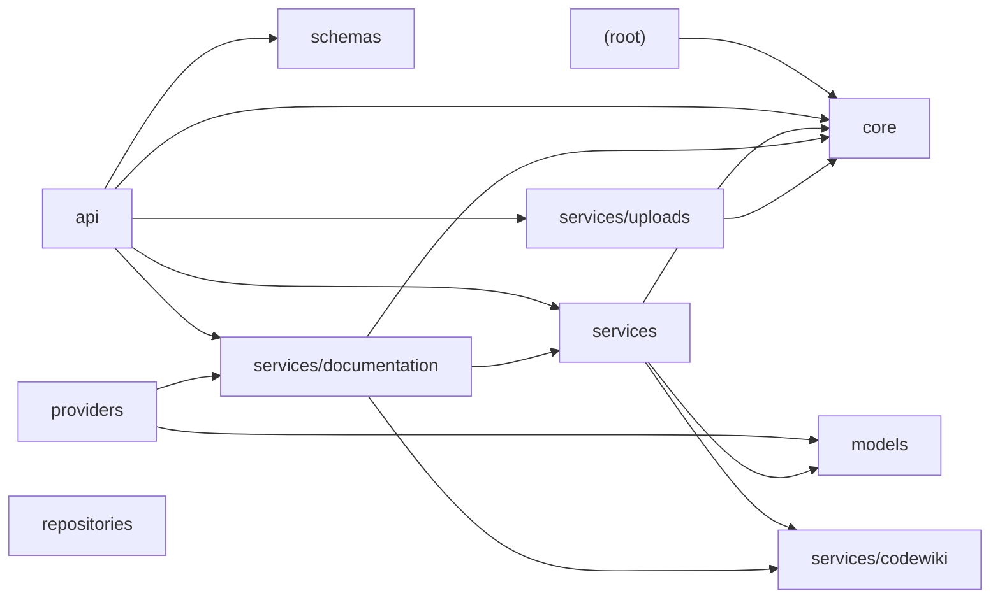

# test-repo

## Table of Contents
1. Purpose
2. End-to-End Architecture
3. System Data Flow
4. Core Components
5. Key Execution Flows
6. External Integrations
7. Configuration and Deployment
8. Key Features / Capabilities
9. Security and Reliability
10. Technology Stack
11. Getting Started / Operational Entry Points
12. Architectural Summary

## 1. Purpose
The system is a FastAPI application designed to manage documentation jobs, provide health checks, and prepare repositories for integration with CodeWiki.

## Architecture

## 2. End-to-End Architecture
### Layers/Subsystems
- **Frontend**: Not explicitly identified in the repository.
- **Backend**: The backend consists of several modules that interact to form the core functionality of the application.
- **Database**: No evidence of a database was identified in the analyzed repository.

### Major Components
- **API Module**: Provides REST endpoints for managing documentation jobs and health checks.
- **Core Module**: Manages error classes for various application issues.
- **Models Module**: Manages the state of documentation for repositories.
- **Providers Module**: Delegates to DocumentationJobService for interacting with CodeWiki.
- **Repositories Module**: Manages in-process storage for documentation jobs.
- **Schemas Module**: Provides API response schemas for jobs and repositories.
- **Services Module**: Fetches documentation metadata from a configured provider. Further divided into:
  - **Documentation Service**: Manages CodeOops job artifacts by storing and retrieving verified outputs.
  - **Codewiki Service**: Reads CodeWiki's output files directly from the shared volume to provide job metadata.
  - **Uploads Service**: Handles ZIP-upload ingestion by saving, validating, extracting, and registering repositories.

### Relationships
- The API module interacts with the core module for error handling.
- The models module is used by the repositories module for state management.
- The services module interacts with both the providers and repositories modules to fetch and manage documentation metadata and job artifacts.

## 3. System Data Flow
1. **User Request**: A user sends a request through the API endpoints.
2. **API Module**: Routes the request to the appropriate service based on the endpoint.
3. **Service Module**: Processes the request, interacts with other modules as needed (e.g., fetching metadata from CodeWiki or managing job artifacts).
4. **Response Generation**: The response is generated using schemas and sent back to the user.

## 4. Core Components
- **API Module** - Purpose: Provides REST endpoints for managing documentation jobs and health checks.
- **Core Module** - Purpose: Manages error classes for various application issues.
- **Models Module** - Purpose: Manages the state of documentation for repositories.
- **Providers Module** - Purpose: Delegates to DocumentationJobService for interacting with CodeWiki.
- **Repositories Module** - Purpose: Manages in-process storage for documentation jobs.
- **Schemas Module** - Purpose: Provides API response schemas for jobs and repositories.
- **Services Module** - Purpose: Fetches documentation metadata from a configured provider.

## 5. Key Execution Flows
1. **Job Creation**: A user uploads a ZIP file, which is handled by the Uploads Service.
2. **Metadata Fetching**: The Documentation Service fetches metadata from CodeWiki using the Codewiki Service.
3. **Artifact Management**: The Documentation Service manages job artifacts and stores them for future reference.

## 6. External Integrations
- **CodeWiki**: Integrated via the Codewiki Service to read output files directly from a shared volume.
- **FastAPI**: Used as the framework for the backend API.

## 7. Configuration and Deployment
No evidence of specific configuration or deployment details was identified in the analyzed repository.

## 8. Key Features / Capabilities
- Manages documentation jobs.
- Provides health checks via REST endpoints.
- Integrates with CodeWiki to fetch metadata.
- Handles ZIP-upload ingestion for repositories.

## 9. Security and Reliability
None were explicitly identified in the repository.

## 10. Technology Stack
- **Backend**: FastAPI, Python
- **Services**: DocumentationService, CodewikiService, UploadsService

## 11. Getting Started / Operational Entry Points
No evidence of specific entry points was identified in the analyzed repository.

## 12. Architectural Summary
The system is a backend application built using FastAPI and Python. It consists of several modules that interact to manage documentation jobs, fetch metadata from CodeWiki, and handle ZIP-upload ingestion for repositories. The major components include API endpoints, error handling, state management, service interactions, and response generation. External integrations are limited to CodeWiki, which is read directly from a shared volume. No database was found in the repository.