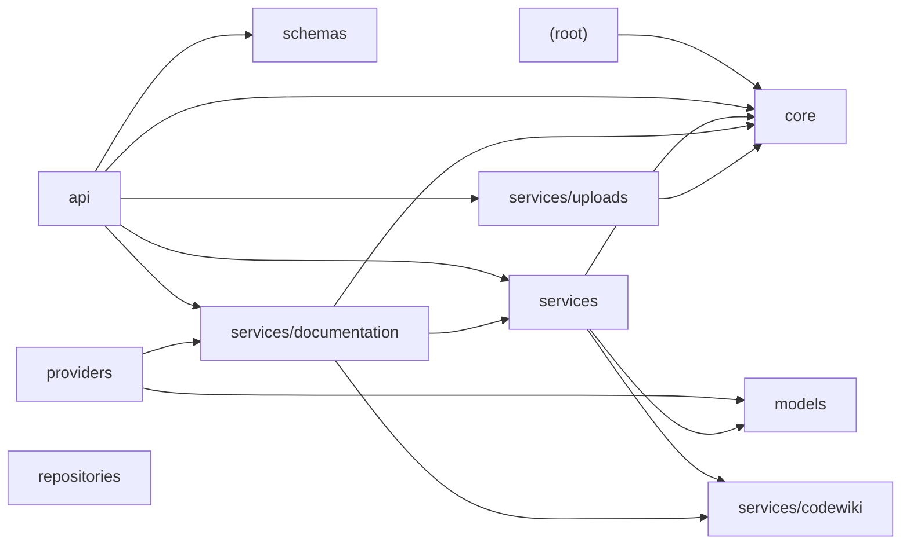

# test-repo

## Table of Contents
1. Purpose
2. End-to-End Architecture
3. System Data Flow
4. Core Components
5. Key Execution Flows
6. External Integrations
7. Configuration and Deployment
8. Key Features / Capabilities
9. Security and Reliability
10. Technology Stack
11. Getting Started / Operational Entry Points

## Purpose
The `test-repo` system is a FastAPI application designed to manage documentation jobs, particularly for integration with CodeWiki. It provides REST endpoints for managing these jobs and health checks.

## Architecture

## End-to-End Architecture
The architecture consists of several layers/subsystems:
- **Frontend**: The FastAPI application instance created in the root module.
- **Backend**: Comprises modules like `api`, `core`, `models`, `providers`, `repositories`, `schemas`, `services`, and their sub-modules.

## System Data Flow
A request to manage a documentation job typically follows this path:
1. The FastAPI application (root) receives the request.
2. It is handled by the API module, which routes it to the appropriate service or repository.
3. For metadata fetching, the `services` module interacts with either `services/codewiki` or `services/documentation`.
4. For job management, the `repositories` and `providers` modules are involved.
5. The response is generated using schemas defined in the `schemas` module and returned to the client.

## Core Components
- **Frontend**: FastAPI application instance (root)
- **Backend**:
  - **Error Handling**: `core`
  - **Documentation Job Management**: `models`, `repositories`, `providers`
  - **Metadata Fetching**: `services/codewiki`, `services/documentation`
  - **Job Artifacts Management**: `services/documentation`
  - **Upload Handling**: `services/uploads`

## Key Execution Flows
- Job creation and management via REST endpoints.
- Metadata fetching from CodeWiki or CodeOops services.
- Repository upload handling.

## External Integrations
- **CodeWiki**: Integrated through the `services/codewiki` module for reading output files directly from a shared volume.
- **CodeOops**: Used by the `services/documentation` module to manage job artifacts.

## Configuration and Deployment
No evidence of specific configuration or deployment details was identified in the analyzed repository.

## Key Features / Capabilities
- Manages documentation jobs.
- Provides REST endpoints for job management and health checks.
- Fetches metadata from CodeWiki and CodeOops services.
- Handles ZIP-upload ingestion by saving, validating, extracting, and registering repositories.

## Security and Reliability
None was identified in the repository.

## Technology Stack
- FastAPI (root)
- Python (language)
- REST APIs for job management
- Integration with CodeWiki and CodeOops services

## Getting Started / Operational Entry Points
Not explicitly identified in the repository.

## Architectural Summary
The `test-repo` system is a FastAPI application designed to manage documentation jobs, primarily integrating with CodeWiki. It consists of a frontend (FastAPI) and backend components that handle job management, metadata fetching, and upload handling. The major data flow involves receiving requests, managing jobs through various services, and returning responses. External integrations are made with CodeWiki and CodeOops for metadata and artifact management. Notably absent is any explicit configuration or deployment documentation.